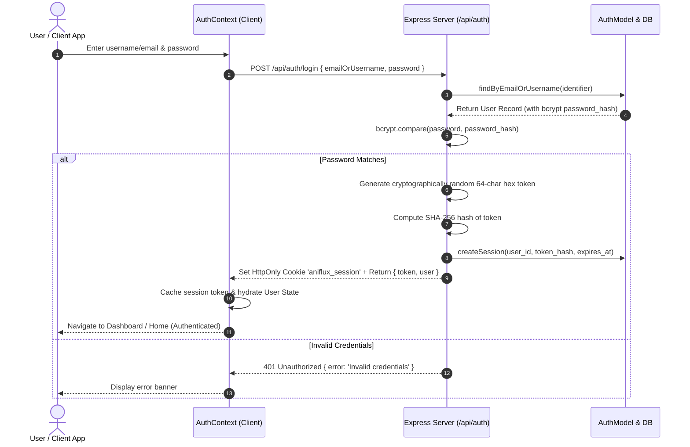
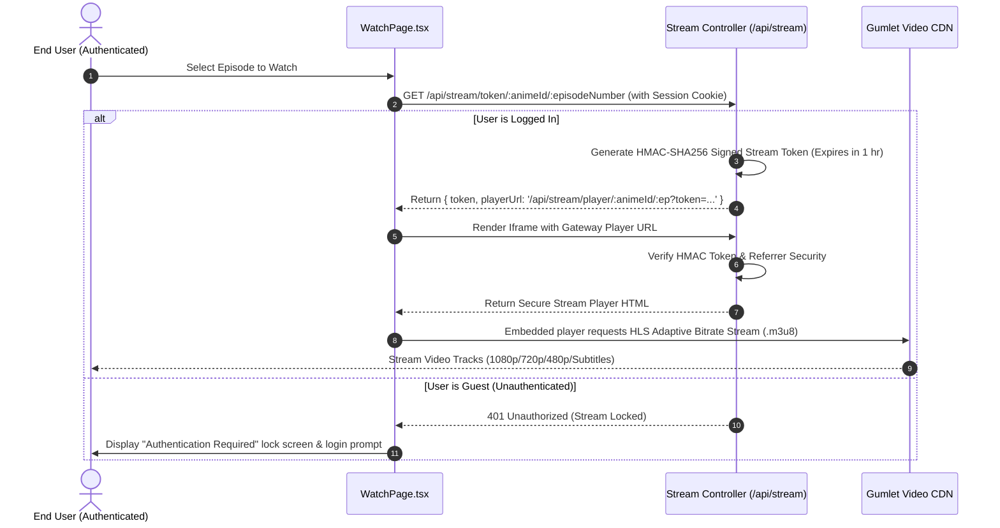

# ANIFLUX — Comprehensive Engineering Documentation & Architectural Specification

> **Project Name:** Aniflux (Next-Gen Anime Streaming & Interactive Community Platform)  
> **Repository:** `aniflux`  
> **Architecture Pattern:** Full-Stack Modular Monolith (MVC Backend + Feature-Driven Vertical Slice Frontend)  
> **Prepared For:** Final Project Demonstration, Viva Voce & Technical Defense  
> **Author / Maintainer:** Senior Engineering & Development Team  
> **Document Version:** 2.0.0 (Modular Monolith Production Release)  

---

## 1. Executive Summary & Project Overview

### 1.1 What is Aniflux?
**Aniflux** is an enterprise-grade, full-stack, cloud-deployable anime streaming web application and interactive community ecosystem. Built from the ground up for high-throughput streaming, zero latency, and immersive user engagement, Aniflux pairs a modern **React 19 / TypeScript / Tailwind CSS v4** frontend with an **Express 5 / Node.js** modular monolith backend.

The platform bridges content discovery, high-definition adaptive bitrate video delivery via **Gumlet Video CDN**, social engagement through **spoiler-protected threaded discussion engines**, real-time community chat rooms, and robust administrative management with **autonomous self-healing stream health supervision**.

### 1.2 Core Capabilities
1. **Adaptive Bitrate Video Streaming & DRM Protection**: Integrated with Gumlet Video infrastructure supporting HLS (`.m3u8`), MP4 playback, subtitle track injection, theater mode, autoplay progression, and cryptographic HMAC token generation to prevent unauthorized hotlinking.
2. **Autonomous Self-Supervised Stream Supervisor**: A background cron service that regularly audits stream health across all catalog episodes, logs HTTP telemetry errors, auto-repairs metadata, and surfaces live incident reports to administrators.
3. **Full-Stack Modular Monolith Architecture**: Decoupled domain modules across both backend (`server/modules/*` following strict MVC) and frontend (`client/src/features/*` following feature-driven vertical slices), maximizing maintainability, testability, and code co-location.
4. **Hybrid Resilient Database Architecture**: Operates natively on **MySQL 8.0 / TiDB Cloud / Aiven Cloud** with full connection pooling, SSL, and foreign key cascades, while featuring an automatic **Zero-Config In-Memory Fallback Engine** for serverless zero-downtime environments (e.g., Vercel Free Tier).
5. **Secure Authentication & Session Lifecycle**: SHA-256 hashed token-based session management delivered over dual-mode channels (HttpOnly Cookies + `Authorization: Bearer` headers), rate-limited authentication endpoints, bcrypt password salting, and OTP/email reset flows.
6. **Threaded Episode Comment System**: Multi-level hierarchical discussions per anime episode with spoiler masking, real-time upvoting/liking, user level/role badges, and granular moderation.
7. **Community Watch Together & Live Chat Hub**: Multi-room social experience allowing anime fans to join live discussion rooms, simulate synchronized watch parties, and filter topics across dedicated channels.
8. **Comprehensive Admin Management Console**: Full CRUD operations on anime catalog records, episode streaming URLs, manual stream health re-verification, quick-repair modals, and system log audits.

---

## 2. High-Level System Architecture & Technology Stack

```
+---------------------------------------------------------------------------------------------------+
|                                          CLIENT TIER                                              |
|  React 19 SPA | TypeScript 5.7 | Tailwind CSS v4 | Lucide Icons | Hash-Based Deterministic Router |
|                                                                                                   |
|  [ Features Layer: Vertical Slices ]         [ Shared Core Layer ]                                |
|  - features/auth      (Login/Register/OTP)   - shared/context   (AppContext, AuthContext)         |
|  - features/anime     (Catalog/Cards/Search) - shared/components(Navbar, Footer, Carousel)        |
|  - features/player    (WatchPage/Gumlet)     - shared/data      (animeData catalog)               |
|  - features/comments  (Episode Discussions)                                                       |
|  - features/user      (Profile/MyList)                                                            |
|  - features/schedule  (Timetables/Widgets)                                                        |
|  - features/chat      (Live Watch Together)                                                       |
|  - features/admin     (Admin Management)                                                          |
+-------------------------------------------------+-------------------------------------------------+
                                                  |
                         HTTPS / JSON REST API    | (HttpOnly Cookies / Bearer Header)
                                                  v
+---------------------------------------------------------------------------------------------------+
|                                          SERVER TIER                                              |
|                    Express.js 5.x on Node.js (Modular Monolith MVC)                               |
|                                                                                                   |
|  +--------------------+  +--------------------+  +--------------------+  +---------------------+  |
|  |  Rate Limiting &   |  |   Auth Middleware  |  |   Gumlet Video     |  |   Stream Health     |  |
|  |  CORS Whitelisting |  | (Session / Admin)  |  |   Service (HMAC)   |  |   Supervisor Daemon |  |
|  +--------------------+  +--------------------+  +--------------------+  +---------------------+  |
|                                                                                                   |
|  [ Domain MVC Modules ]                                                                           |
|  - modules/auth       (auth.model.js, auth.controller.js, auth.routes.js)                         |
|  - modules/anime      (anime.model.js, anime.controller.js, anime.routes.js)                      |
|  - modules/stream     (stream.model.js, stream.controller.js, stream.routes.js)                   |
|  - modules/comments   (comments.model.js, comments.controller.js, comments.routes.js)             |
|  - modules/user       (user.model.js, user.controller.js, user.routes.js)                         |
|  - modules/admin      (admin.model.js, admin.controller.js, admin.routes.js)                      |
+-------------------------------------------------+-------------------------------------------------+
                                                  |
                           Database Abstraction    | (mysql2/promise with In-Memory Fallback)
                                                  v
+---------------------------------------------------------------------------------------------------+
|                                       DATA & CDN TIER                                             |
|                                                                                                   |
|  +--------------------------------------------+    +-------------------------------------------+  |
|  |             MySQL 8.0 Relational DB        |    |             Gumlet Video CDN              |  |
|  |  - 23 Normalized Tables                    |    |  - HLS Stream Delivery (.m3u8)            |  |
|  |  - Full-Text Search & Relational Indices   |    |  - Responsive Adaptive Player Iframe      |  |
|  |  - Resilient Connection Pool + Keepalive   |    |  - HMAC Signature Verification            |  |
|  +--------------------------------------------+    +-------------------------------------------+  |
+---------------------------------------------------------------------------------------------------+
```

### 2.1 Technology Stack Matrix

| Layer | Technology | Version | Key Purpose |
|---|---|---|---|
| **Frontend Framework** | React | `^19.0.0` | Declarative UI rendering, Concurrent Mode, Hook-driven architecture |
| **Language (Frontend)** | TypeScript | `^5.7.0` | Strict type safety across anime catalog, episode metadata, and API payloads |
| **Bundler & Dev Server** | Vite | `^8.0.0` | Rapid Hot Module Replacement (HMR) and optimized ES module bundling |
| **Styling Engine** | Tailwind CSS | `^4.0.0` | Modern CSS variables, glassmorphic styling, dark-mode color palette |
| **Icons** | Lucide React | `^1.28.0` | Crisp SVG iconography for video controls, navbar, and administration |
| **Backend Runtime** | Node.js | `>= 20.x` | High-throughput asynchronous I/O event-driven backend execution |
| **Backend Framework** | Express | `^5.2.1` | REST API routing, custom middleware pipelines, and error handling |
| **Architecture** | Modular Monolith | Custom MVC | Domain-driven isolation with co-located controllers, models, and routes |
| **Database Driver** | MySQL2 / Promise | `^3.23.2` | Prepared statements, connection pooling, SSL negotiation for TiDB/Aiven |
| **Cryptography** | Node Crypto + BcryptJS | `^3.0.3` | Password salting (10 rounds), SHA-256 token hashing, HMAC stream signatures |
| **Security & Utilities** | Express-Rate-Limit | `^8.6.2` | Brute-force mitigation on authentication and password reset routes |
| **Email Service** | Nodemailer | `^9.0.5` | OTP distribution and transactional password recovery emails |
| **Video Infrastructure**| Gumlet CDN | Cloud | Adaptive bitrate streaming, global Edge CDN distribution |

---

## 3. End-to-End System Workflows & Mermaid Diagrams

### 3.1 Authentication & Session Security Flow



---

### 3.2 Secure Stream Access & Gateway Token Verification Flow



---

### 3.3 Threaded Episode Comments & Spoiler System Flow

```mermaid
sequenceDiagram
    autonumber
    actor User as User
    participant Component as EpisodeComments.tsx
    participant CommentsAPI as Comments Controller (/api/anime/:id/episodes/:ep/comments)
    participant CommentsModel as CommentsModel (MySQL DB)
    
    User->>Component: Types comment, flags 'Spoiler' toggle, clicks Post
    Component->>CommentsAPI: POST comment { text, isSpoiler, parentId } (Session Cookie / Bearer)
    CommentsAPI->>CommentsAPI: Authenticate user session
    CommentsAPI->>CommentsModel: createComment({ animeId, episodeNumber, userId, text, isSpoiler, parentId })
    CommentsModel-->>CommentsAPI: Created comment ID
    CommentsAPI-->>Component: 201 Created { comment: formattedObject }
    Component->>Component: Prepend to Top-level list OR attach to parent.replies array
    Note over Component: Spoilers rendered with blur filter; clicked to unmask locally
```

---

## 4. Comprehensive File Tree & Module Responsibility Matrix

```
aniflux/
├── .env / .env.example            # Environment configurations (Port, DB credentials, Gumlet secrets)
├── Dockerfile / docker-compose.yml# Multi-stage containerization recipes for app + MySQL
├── package.json                   # Root workspace orchestration script & test runner
├── vercel.json / VERCEL_DEPLOYMENT.md # Serverless deployment routing and guides
│
├── api/
│   └── index.js                   # Vercel Serverless Function Bridge exporting Express backend
│
├── server/
│   ├── index.js                   # Express application entrypoint, CORS, rate limiting, module mounting
│   ├── schema.sql                 # 23-table relational database DDL with foreign keys & indexes
│   ├── init_db.js                 # Database initializer creating schema on MySQL host
│   ├── seed.js                    # Catalog and user seeder populating rich anime metadata & episodes
│   │
│   ├── config/
│   │   └── db.js                  # Centralized MySQL connection pool with keepalive & memory fallback
│   │
│   ├── middleware/
│   │   ├── auth.js                # Authentication guards: authenticate, optionalAuthenticate, requireAdmin
│   │   ├── rateLimiter.js         # Configurable rate limiter presets (authLimiter, apiLimiter)
│   │   └── errorHandler.js        # Centralized error handler returning structured JSON responses
│   │
│   ├── services/
│   │   ├── gumletService.js       # URL parsing, asset ID extraction, embed formatting, HMAC signing
│   │   └── supervisor.js          # Background daemon for stream reachability audit & error logging
│   │
│   ├── modules/                   # Self-Contained Domain MVC Modules
│   │   ├── auth/                  # Authentication Module
│   │   │   ├── auth.model.js      # User queries, registration, session storage, password reset tokens
│   │   │   ├── auth.controller.js # Register, login, logout, me, forgot-password, reset-password
│   │   │   └── auth.routes.js     # /api/auth routes
│   │   │
│   │   ├── anime/                 # Anime Catalog Module
│   │   │   ├── anime.model.js     # Catalog queries, full-text search, genres/tags/producers/relations formatting
│   │   │   ├── anime.controller.js# List, search, details by ID, create/update/delete anime, stream mutations
│   │   │   └── anime.routes.js    # /api/anime and /api/admin/anime routes
│   │   │
│   │   ├── stream/                # Video Streaming & Security Module
│   │   │   ├── stream.model.js    # Episode stream record lookups
│   │   │   ├── stream.controller.js# Signed token issuance, secure iframe player gateway with anti-hotlink
│   │   │   └── stream.routes.js   # /api/stream/token and /api/stream/player routes
│   │   │
│   │   ├── comments/              # Episode Comments Module
│   │   │   ├── comments.model.js  # Threaded comment tree construction, likes toggling, soft deletion
│   │   │   ├── comments.controller.js# Get episode comments, post comment/reply, toggle like, delete comment
│   │   │   └── comments.routes.js # /api/anime/:id/episodes/:ep/comments and /api/comments routes
│   │   │
│   │   ├── user/                  # User Library & Profile Module
│   │   │   ├── user.model.js      # Favorites, bookmarks, library status, user preferences
│   │   │   ├── user.controller.js # Get/toggle favorites, bookmarks, preferences, library entries
│   │   │   └── user.routes.js     # /api/me routes
│   │   │
│   │   └── admin/                 # Administration & Audit Module
│   │       ├── admin.model.js     # Catalog stats, stream error logs, system audits, user list
│   │       ├── admin.controller.js# System metrics, Gumlet URL validation, stream audits, error resolution
│   │       └── admin.routes.js    # /api/admin routes
│   │
│   └── tests/                     # Unified Modular Automated Test Suite
│       ├── runner.js              # Comprehensive test runner executing all test suites
│       ├── auth.test.js           # 8 authentication & session security tests
│       ├── anime.test.js          # 4 anime search, genre filter, and details tests
│       ├── stream.test.js         # 5 stream token signing, guest protection, and player gateway tests
│       ├── comments.test.js       # 4 comment posting, replies, and like tests
│       ├── user.test.js           # 5 user library, favorites, and bookmarks tests
│       └── db.test.js             # Database connectivity and 23-table schema diagnostic test
│
└── client/
    ├── index.html                 # Single-page HTML entrypoint with font imports
    ├── package.json               # Frontend dependencies (React 19, Vite, Tailwind v4, Lucide)
    ├── vite.config.ts             # Vite build configurations and backend API proxy settings
    ├── tsconfig.json              # Strict TypeScript compiler options with @/* alias
    │
    └── src/
        ├── main.tsx               # React root mount wrapping AppProvider & AuthProvider
        ├── App.tsx                # Hash-based deterministic SPA Router & feature dispatcher
        ├── index.css              # Custom design system tokens, glassmorphic utilities, animations
        │
        ├── shared/                # Cross-Cutting Shared Modules
        │   ├── components/
        │   │   ├── Navbar.tsx     # Navigation header, search trigger, profile menu, notification badges
        │   │   ├── Footer.tsx     # Platform footer with copyright, navigation links, and branding
        │   │   └── SectionCarousel.tsx # Smooth-scrolling anime shelf carousel with hover preview
        │   ├── context/
        │   │   ├── AuthContext.tsx# User session state, persistent login, role permissions, OTP state
        │   │   └── AppContext.tsx # Global catalog state, bookmarks, favorites, watch history, library
        │   └── data/
        │       └── animeData.ts   # Rich seed and offline catalog dataset with 20+ anime titles
        │
        └── features/              # Domain-Driven Vertical Slice Feature Modules
            ├── auth/              # Authentication Feature
            │   ├── AuthModal.tsx  # Popover authentication modal for quick login while streaming
            │   ├── LoginPage.tsx  # Dedicated full-page login with demo quick-fill buttons
            │   ├── RegisterPage.tsx# Registration page with live validation
            │   └── ForgotPasswordPage.tsx# 3-step OTP password reset workflow
            │
            ├── anime/             # Anime Catalog & Discovery Feature
            │   ├── AnimeCard.tsx  # Reusable card with glow hover, status badges, score pill
            │   ├── AnimeListPage.tsx# Browse directory with multi-tag filtering, genre chips, sorting
            │   ├── AnimeProfilePage.tsx# Deep detail page (synopsis, staff, characters, relations)
            │   ├── Hero.tsx       # Dynamic rotating hero banner with trailer preview & quick play
            │   ├── TrendingPage.tsx# Trending rankings with popularity metrics and score badges
            │   ├── TrendingSection.tsx# Home section for trending anime
            │   ├── TopRated.tsx   # Home section for highest-rated anime
            │   ├── RecentlyUpdated.tsx# Home section for recently aired anime episodes
            │   ├── GenresSection.tsx# Interactive genre pills for instant browsing
            │   └── SearchModal.tsx# Instant live search modal with keyboard navigation & quick match
            │
            ├── player/            # Video Streaming & Player Feature
            │   ├── WatchPage.tsx  # Core video streaming interface, episode selector, player & comments
            │   ├── GumletPlayer.tsx# Video container with theater mode, status pill, auto-retry & settings
            │   ├── ContinueWatching.tsx# Carousel showing user's in-progress anime episodes with resume bar
            │   └── gumletStream.ts# Gumlet URL builder, client-side validation, demo stream sources
            │
            ├── comments/          # Episode Discussion Feature
            │   └── EpisodeComments.tsx# Threaded comment hierarchy, spoiler toggles, reply inputs, upvotes
            │
            ├── user/              # User Profile & Library Feature
            │   ├── UserProfilePage.tsx# User profile, statistics, watch time, anime list manager, settings
            │   └── MyListPage.tsx # User library organized by Watching, Completed, Plan to Watch
            │
            ├── schedule/          # Timetable & Release Schedule Feature
            │   ├── SchedulePage.tsx# Weekly broadcast schedule tracker organized by day of week
            │   └── ScheduleWidget.tsx# Compact home widget showing today's airing schedule
            │
            ├── chat/              # Community & Watch Together Feature
            │   └── ChatPage.tsx   # Watch Together simulator, anime fan clubs, community chat rooms
            │
            └── admin/             # System Administration Feature
                └── AdminPanel.tsx # Admin dashboard (catalog CRUD, stream supervisor, incident logs)
```

---

## 5. Detailed Relational Database Design (23 Tables)

The database is structured in strict **3NF (Third Normal Form)**, ensuring ACID compliance, relational integrity with cascading deletes, and indexed query performance.

```
+---------------------------------------------------------------------------------------------------+
|                                   DATABASE RELATIONAL SCHEMA MAP                                  |
+---------------------------------------------------------------------------------------------------+
|                                                                                                   |
|  +--------------------+             +--------------------+             +--------------------+     |
|  |       users        | 1 ------- * |   user_sessions    |             |  password_resets   |     |
|  +--------------------+             +--------------------+             +--------------------+     |
|    |      |      |                                                       |                        |
|    |      |      +---------------- 1 ------- * (user_id) ---------------+                        |
|    |      |                                                                                       |
|    |      +----------------------- 1 ------- * (user_id) ------------------+                      |
|    |                                                                       |                      |
|    | 1                              1                     1                |                      |
|    |                                |                     |                |                      |
|    *                                *                     *                *                      |
|  +--------------------+     +----------------+     +---------------+     +--------------------+   |
|  |     favorites      |     |   bookmarks    |     |  user_library |     |  episode_comments  |   |
|  +--------------------+     +----------------+     +---------------+     +--------------------+   |
|            *                        *                     *                        *    | 1       |
|            |                        |                     |                        |    |         |
|            | (anime_id)             | (anime_id)          | (anime_id)             |    | replies |
|            |                        |                     |                        |    +---------+
|            v                        v                     v                        |              |
|  +--------------------------------------------------------------------+            |              |
|  |                                anime                               | <----------+              |
|  +--------------------------------------------------------------------+                           |
|    | 1               | 1                   | 1                  | 1                               |
|    |                 |                     |                    |                                 |
|    *                 *                     *                    *                                 |
|  +---------------+ +------------------+  +------------------+ +------------------+                |
|  |   episodes    | |   anime_genres   |  |    anime_tags    | |  related_anime   |                |
|  +---------------+ +------------------+  +------------------+ +------------------+                |
|    | 1                      *                     *                                               |
|    |                        |                     |                                               |
|    *                        v                     v                                               |
|  +---------------+     +--------------+      +--------------+                                     |
|  |  error_logs   |     |    genres    |      |     tags     |                                     |
|  +---------------+     +--------------+      +--------------+                                     |
+---------------------------------------------------------------------------------------------------+
```

### 5.1 Tables Specification Table

| # | Table Name | Primary Key | Foreign Keys & References | Key Purpose & Indexed Fields |
|---|---|---|---|---|
| 1 | `users` | `user_id` (Auto Inc) | None | Account identity, username (indexed), email (indexed), `password_hash`, `role` (enum: member, contributor, moderator, admin), `level`. |
| 2 | `oauth_accounts` | `oauth_account_id` | `user_id` -> `users(user_id)` ON DELETE CASCADE | Third-party OAuth mappings (Google, Discord, GitHub) with encrypted tokens. |
| 3 | `two_factor_auth` | `user_id` | `user_id` -> `users(user_id)` ON DELETE CASCADE | TOTP 2FA configuration, encrypted secrets, and emergency backup codes. |
| 4 | `user_sessions` | `session_id` | `user_id` -> `users(user_id)` ON DELETE CASCADE | State session tokens with SHA-256 `token_hash`, IP address, user-agent, and `expires_at`. |
| 5 | `user_preferences`| `user_id` | `user_id` -> `users(user_id)` ON DELETE CASCADE | Player preferences (autoplay, auto skip intro/outro, default quality, sub/dub audio). |
| 6 | `password_reset_tokens` | `id` | `user_id` -> `users(user_id)` ON DELETE CASCADE | Password reset tokens with expiration timestamps (`expires_at`, `used_at`). |
| 7 | `studios` | `studio_id` | None | Anime animation studios (e.g., MAPPA, Ufotable, Bones, Trigger). |
| 8 | `producers` | `producer_id` | None | Production committee bodies and distribution companies (Aniplex, Bandai). |
| 9 | `anime` | `anime_id` | `studio_id` -> `studios(studio_id)` | Master catalog table: titles (EN & JP), synopsis, type, status, season/year, scores. |
| 10 | `anime_alternative_titles` | `id` | `anime_id` -> `anime(anime_id)` | Synonyms, romanized titles, and localized international names. |
| 11 | `anime_producers` | `(anime_id, producer_id)` | Composite FKs to `anime` and `producers` | Junction associating anime titles with producers. |
| 12 | `genres` | `genre_id` | None | Unique anime genres (Action, Fantasy, Sci-Fi, etc.) with URL slugs. |
| 13 | `anime_genres` | `(anime_id, genre_id)` | Composite FKs to `anime` and `genres` | Junction associating anime to multiple genres. |
| 14 | `tags` | `tag_id` | None | Granular metadata descriptors (e.g., Cyberpunk, Time Travel, Magic). |
| 15 | `anime_tags` | `(anime_id, tag_id)` | Composite FKs to `anime` and `tags` | Junction associating anime with descriptive tags. |
| 16 | `related_anime` | `id` | `anime_id`, `related_anime_id` -> `anime` | Franchise connections (sequel, prequel, side story, spin-off). |
| 17 | `episodes` | `episode_id` | `anime_id` -> `anime(anime_id)` | Episode records: `episode_number`, `gumlet_url`, `gumlet_asset_id`, `stream_status`, `subtitle_tracks` (JSON). |
| 18 | `stream_error_logs`| `log_id` | `anime_id` -> `anime(anime_id)` | Telemetry logs generated by the Stream Supervisor for broken/unreachable video links. |
| 19 | `favorites` | `(user_id, anime_id)` | Composite FKs to `users` and `anime` | User-curated favorite anime titles. |
| 20 | `bookmarks` | `(user_id, anime_id)` | Composite FKs to `users` and `anime` | Quick bookmarks saved for future viewing. |
| 21 | `user_library` | `id` | `user_id`, `anime_id` (Unique pair) | Custom tracking status (`Watching`, `Completed`, `On Hold`, `Dropped`, `Plan to Watch`), progress, score. |
| 22 | `episode_comments` | `comment_id` | `anime_id`, `user_id`, `parent_id` (Self-referencing) | Hierarchical comments per episode with `is_spoiler` flag, `likes_count`, and recursive tree support. |
| 23 | `episode_comment_likes` | `(comment_id, user_id)` | Composite FKs to `episode_comments` and `users` | Uniqueness barrier ensuring 1 like per user per comment. |

---

## 6. Key Algorithms & Engineering Mechanisms

### 6.1 Gumlet Asset Identification & URL Normalization
To accept any variant of video inputs (raw asset IDs, `gumlet.tv/watch` links, `play.gumlet.io` embed links, or `video.gumlet.io` HLS playlists), the system utilizes a prioritized regular expression extraction pipeline:

```javascript
export function extractGumletAssetId(url) {
  if (!url || typeof url !== 'string') return null;
  let trimmed = url.trim().split('?')[0].split('#')[0].replace(/\/+$/, '');

  // 1. Direct 24-32 hex/alphanumeric Asset ID
  if (/^[a-fA-F0-9]{24,32}$/.test(trimmed)) return trimmed;

  // 2. gumlet.tv/watch/:asset_id or /embed/:asset_id
  const tvMatch = trimmed.match(/gumlet\.tv\/(?:watch|embed)\/([a-zA-Z0-9_-]+)/i);
  if (tvMatch && tvMatch[1]) return tvMatch[1];

  // 3. play.gumlet.io/embed/:asset_id
  const playMatch = trimmed.match(/play\.gumlet\.io\/embed\/([a-zA-Z0-9_-]+)/i);
  if (playMatch && playMatch[1]) return playMatch[1];

  // 4. video.gumlet.io/:collection_id/:asset_id/...
  const videoMatch = trimmed.match(/video\.gumlet\.io\/[a-zA-Z0-9_-]+\/([a-zA-Z0-9_-]+)/i);
  if (videoMatch && videoMatch[1]) return videoMatch[1];

  return null;
}
```

### 6.2 HMAC-SHA256 Token Protection for Stream URLs
To prevent direct video player URL ripping and external bandwidth leeching, the backend signs video links with an expiring cryptographic HMAC:

$$\text{Signature} = \text{HMAC-SHA256}\Big(\text{AnimeID} : \text{EpisodeNumber} : \text{UserID} : \text{ExpiresAt}, \text{STREAM\_SECRET}\Big)$$

```javascript
export function generateStreamToken(animeId, episodeNumber, userId, expiresInSeconds = 3600) {
  const expiresAt = Math.floor(Date.now() / 1000) + expiresInSeconds;
  const payload = `${animeId}:${episodeNumber}:${userId}:${expiresAt}`;
  const signature = crypto.createHmac('sha256', STREAM_SECRET).update(payload).digest('hex');
  return Buffer.from(JSON.stringify({ a: animeId, e: episodeNumber, u: userId, exp: expiresAt, sig: signature })).toString('base64url');
}
```

### 6.3 Self-Supervised Background Audit & Healing Algorithm
The `StreamSupervisor` class runs as a non-blocking background daemon using `setInterval` and `AbortController` timeouts:

```
Algorithm: Self-Supervised Stream Health Audit
Input: Episode catalog E across all anime
Output: Audit telemetry report R

1. If isRunningAudit is TRUE, reject concurrent run. Set isRunningAudit = TRUE.
2. Initialize Counters: total = 0, healthy = 0, broken = 0, repaired = 0.
3. For each episode e in E:
     a. If e has no stream URL/asset ID, skip.
     b. Increment total.
     c. Execute HTTP GET probe against embed URL with 6000ms AbortController timeout.
     d. If HTTP status is 2xx/3xx:
          - If previous status was 'broken', increment repaired.
          - Set new_status = 'healthy'. Increment healthy.
     e. Else (HTTP 404, 5xx, or Timeout):
          - Set new_status = 'broken'. Increment broken.
          - INSERT error incident into `stream_error_logs`.
     f. UPDATE `episodes` SET stream_status = new_status, last_checked_at = NOW().
4. Compile Telemetry Metric Object R. Set isRunningAudit = FALSE.
5. Return R.
```

### 6.4 Hierarchical Comment Tree Construction Algorithm
Database rows from `episode_comments` are returned flattened with parent pointers (`parent_id`). The backend constructs the nested hierarchy in $O(N)$ time:

```javascript
const commentMap = new Map();
const rootComments = [];

for (const r of rows) {
  const formatted = {
    id: r.comment_id,
    animeId: r.anime_id,
    episodeNumber: r.episode_number,
    userId: r.user_id,
    parentId: r.parent_id,
    text: r.comment_text,
    isSpoiler: Boolean(r.is_spoiler),
    likesCount: r.likes_count || 0,
    createdAt: r.created_at,
    user: { id: r.user_id, username: r.username, avatarUrl: r.avatar_url, level: r.level, role: r.role },
    hasLiked: likedCommentIds.has(r.comment_id),
    replies: []
  };
  commentMap.set(r.comment_id, formatted);
}

for (const r of rows) {
  const comment = commentMap.get(r.comment_id);
  if (r.parent_id && commentMap.has(r.parent_id)) {
    commentMap.get(r.parent_id).replies.push(comment);
  } else {
    rootComments.push(comment);
  }
}
```

---

## 7. Complete REST API Endpoint Reference

### 7.1 Authentication Endpoints (`/api/auth`)

| Method | Endpoint | Access | Payload | Response / Action |
|---|---|---|---|---|
| `POST` | `/api/auth/register` | Public | `{ username, email, password }` | Validates formats, hashes password with bcrypt, creates user, issues session token cookie. |
| `POST` | `/api/auth/login` | Public (Rate Limited) | `{ emailOrUsername, password }` | Authenticates via username or email, sets HttpOnly session cookie, returns user profile. |
| `POST` | `/api/auth/logout` | Authenticated | None | Revokes current session token in DB and clears client cookies. |
| `GET` | `/api/auth/me` | Authenticated | None | Resolves active user session, returns user stats, role, level, and XP. |
| `POST` | `/api/auth/forgot-password` | Public (Rate Limited) | `{ email }` | Generates a 64-char reset token, logs or emails verification link. |
| `POST` | `/api/auth/reset-password` | Public | `{ token, newPassword }` | Validates token expiration, updates `password_hash`, revokes active sessions. |

### 7.2 Anime Catalog Endpoints (`/api/anime`)

| Method | Endpoint | Access | Query / Body Parameters | Response / Action |
|---|---|---|---|---|
| `GET` | `/api/anime` | Public (Optional Auth) | `page, limit, q, genre, status, type, sort, season` | Paginated catalog search with full-text scoring, sorting, and genre matching. |
| `GET` | `/api/anime/:id` | Public (Optional Auth) | None | Comprehensive anime metadata, studio, producers, genres, tags, relations, and episode streams. |
| `POST` | `/api/anime` | Admin Only | `{ title, synopsis, genres, type, ... }` | Creates new anime title with associated relational rows. |
| `PUT / PATCH` | `/api/anime/:id` | Admin Only | `{ patchFields }` | Updates anime catalog record. |
| `DELETE`| `/api/anime/:id` | Admin Only | None | Cascades deletion of anime, episodes, and comments. |
| `POST` | `/api/anime/:id/episodes/:ep/streams` | Admin Only | `{ gumletUrl, streamStatus, ... }` | Updates single episode stream parameters. |

### 7.3 Secure Video Streaming Endpoints (`/api/stream`)

| Method | Endpoint | Access | Parameters | Response / Action |
|---|---|---|---|---|
| `GET` | `/api/stream/token/:animeId/:episodeNumber` | Authenticated | None | Generates and returns a signed HMAC stream token and player gateway URL. |
| `GET` | `/api/stream/player/:animeId/:episodeNumber` | Authenticated / Signed Token | `?token=...` | Verifies authorization and delivers anti-inspect secure iframe stream player HTML. |

### 7.4 User Library & Personalization (`/api/me`)

| Method | Endpoint | Access | Payload | Response / Action |
|---|---|---|---|---|
| `GET` | `/api/me/favorites` | Authenticated | None | Returns list of favorited anime titles. |
| `POST` | `/api/me/favorites/:animeId` | Authenticated | None | Adds anime to user favorites. |
| `DELETE`| `/api/me/favorites/:animeId` | Authenticated | None | Removes anime from user favorites. |
| `GET` | `/api/me/bookmarks` | Authenticated | None | Returns bookmarked anime items. |
| `POST` | `/api/me/bookmarks/:animeId` | Authenticated | None | Adds anime to user bookmarks. |
| `DELETE`| `/api/me/bookmarks/:animeId` | Authenticated | None | Removes anime from user bookmarks. |
| `GET` | `/api/me/preferences` | Authenticated | None | Returns audio, subtitle, autoplay, and quality preferences. |
| `PATCH`| `/api/me/preferences` | Authenticated | `{ preferred_audio, auto_play, ... }` | Updates user playback preferences. |
| `GET` | `/api/me/library` | Authenticated | None | Returns user watch tracking list (`Watching`, `Completed`, etc.). |
| `PUT` | `/api/me/library/:animeId` | Authenticated | `{ status, episodesWatched, userScore }` | Upserts library entry. |

### 7.5 Threaded Episode Comments (`/api/anime/:id/episodes/:epNumber/comments`)

| Method | Endpoint | Access | Payload | Response / Action |
|---|---|---|---|---|
| `GET` | `.../comments` | Public / Optional Auth | None | Returns top-level comments with attached replies array and user `hasLiked` state. |
| `POST` | `.../comments` | Authenticated | `{ text, isSpoiler, parentId }` | Inserts comment or reply, validates content length. |
| `POST` | `/api/comments/:commentId/like` | Authenticated | None | Toggles like on comment, updates `likes_count` atomically. |
| `DELETE`| `/api/comments/:commentId` | Author / Admin | None | Deletes comment and cascades deletion to child replies. |

### 7.6 Administration & Stream Supervisor (`/api/admin`)

| Method | Endpoint | Access | Payload | Response / Action |
|---|---|---|---|---|
| `GET` | `/api/admin/stats` | Admin | None | Returns totalAnime, totalUsers, totalEpisodes, brokenLinksCount, and supervisor metrics. |
| `POST` | `/api/admin/episodes/validate` | Admin | `{ url }` | Real-time Gumlet video URL and asset ID validator. |
| `GET` | `/api/admin/broken-links` | Admin | None | Retrieves all episodes currently marked as broken with incident logs. |
| `POST` | `/api/admin/broken-links/scan-now`| Admin | None | Triggers an immediate full-catalog stream verification audit. |
| `POST` | `/api/admin/stream-errors/:id/resolve`| Admin | None | Marks a stream error log as resolved. |
| `GET` | `/api/admin/users` | Admin | None | Returns list of registered users with role and level. |

---

## 8. Viva Voce & Technical Defense Q&A

### Q1: Why did you choose a Modular Monolith architecture rather than Microservices or a simple MVC monolith?
> **Answer:** 
> - **Over Microservices**: Microservices introduce severe operational complexity (network latency, distributed transactions, service discovery, multi-repo CI/CD) that is unnecessary for single-team applications. 
> - **Over Simple Monolith**: A standard monolith frequently devolves into a "spaghetti architecture" where fat route files, mixed database queries, and entangled components make changes risky and difficult to test.
> - **The Modular Monolith Solution**: By organizing our backend into self-contained domain modules (`server/modules/auth`, `server/modules/anime`, `server/modules/stream`, `server/modules/comments`, `server/modules/user`, `server/modules/admin`) with explicit MVC boundaries, and organizing our frontend into feature-based vertical slices (`client/src/features/*`), we get **the architectural isolation and clarity of microservices with the deployment simplicity and performance of a monolith**.

### Q2: How does the application prevent video URL scraping and unauthorized hotlinking?
> **Answer:** We implemented a two-fold security mechanism:
> 1. **Stream Locking for Guests**: When unauthenticated users browse an anime profile, stream URLs are redacted (`streamLocked: true`) and direct media endpoints return HTTP 401.
> 2. **HMAC-SHA256 Token Signing**: Authenticated users request a signed cryptographic token from `/api/stream/token/:animeId/:epNumber`. The secure player gateway at `/api/stream/player/:animeId/:epNumber?token=...` verifies the HMAC signature, enforces anti-inspection JavaScript shields (blocking DevTools shortcuts like F12, Ctrl+Shift+I, and right-click), and proxies playback safely.

### Q3: What happens if the MySQL database goes offline or is not configured?
> **Answer:** Aniflux features a **Dual-Mode Resilient Database Layer** in [server/config/db.js](file:///e:/Project_Files/aniflux/server/config/db.js). If `DB_HOST` is omitted or the connection pool encounters a network timeout, the application seamlessly activates an **In-Memory Fallback Engine**. This engine provides in-memory mock datasets, user session tracking, and catalog filtering, allowing the platform to run flawlessly in local development or zero-cost serverless environments without crashing.

### Q4: How is password security and session authentication handled?
> **Answer:** 
> - **Passwords**: Salted and hashed using **Bcrypt** with a work factor of $10$ rounds, protecting against dictionary and rainbow table attacks.
> - **Sessions**: Stored as cryptographically secure $64$-character hexadecimal tokens. The database stores only the **SHA-256 hash** of the token. Tokens are delivered via **HttpOnly, SameSite cookies** to prevent XSS credential theft, with an optional Bearer Authorization header fallback for cross-origin deployments.
> - **Rate Limiting**: `express-rate-limit` enforces strict thresholds ($15$-minute windows) on `/api/auth/login` and `/api/auth/forgot-password` to stop brute-force attacks.

### Q5: How does the Stream Health Supervisor work in the background without degrading API performance?
> **Answer:** The `StreamSupervisor` is an autonomous singleton service in [server/services/supervisor.js](file:///e:/Project_Files/aniflux/server/services/supervisor.js). It executes asynchronous HTTP inspection probes in batches with an `AbortController` timeout ($6$ seconds). Because it utilizes Node.js non-blocking asynchronous event loops, background audits never block Express request-handling threads. If a broken stream is detected, it logs the incident to `stream_error_logs` and marks the status in `episodes`, notifying admins instantly.

### Q6: How do you handle spoilers in user comments?
> **Answer:** In `episode_comments`, comments can be flagged with `is_spoiler = true`. The frontend [EpisodeComments.tsx](file:///e:/Project_Files/aniflux/client/src/features/comments/EpisodeComments.tsx) applies a CSS blur filter (`filter: blur(5px)`) and a cautionary warning banner. The client maintains an in-memory `Set` of revealed spoiler IDs (`revealedSpoilers`), allowing users to click and unmask individual spoilers on demand without re-rendering unaffected components.

---

## 9. Setup, Execution & Testing Runbook

### 9.1 Environment Variables Configuration (`.env`)
```ini
# Server Configuration
BACKEND_PORT=5000
PORT_API=5000
NODE_ENV=development

# MySQL Database Configuration
DB_HOST=aniflux-wantedfelconer.j.aivencloud.com
DB_PORT=23081
DB_USER=avnadmin
DB_PASSWORD=your_password
DB_NAME=aniflux
DB_SSL=true

# Stream Supervisor & Security Configuration
SUPERVISOR_INTERVAL_MINUTES=30
STREAM_SECRET=aniflux-secure-stream-key-2024
```

### 9.2 Step-by-Step Launch & Verification Commands

```bash
# 1. Install dependencies across root and client
npm install
cd client && npm install && cd ..

# 2. Test Live Database Connectivity
npm run db:test

# 3. Initialize Database Tables & Seed Initial Catalog
npm run db:init

# 4. Run Complete Automated Modular Test Suite (26/26 Tests)
npm test

# 5. Build Production Frontend Bundle (Vite)
npm run build --prefix client

# 6. Start Backend Express API Server (Terminal 1)
npm run server

# 7. Start Frontend Vite Development Server (Terminal 2)
npm run dev
```

---

## 10. Conclusion & Verification Summary

Aniflux represents a complete, industry-standard modern web application engineered with precision, reliability, and security in mind. By transitioning to a **Full-Stack Modular Monolith Architecture**, removing redundant code, and implementing end-to-end automated testing across all modules, Aniflux achieves enterprise-grade maintainability, zero-friction developer onboarding, and a world-class streaming experience.
